# ACTIVITY DIAGRAMS – HỆ THỐNG OMNICHAT

---

## I. USER MODULE

### Đăng ký tài khoản

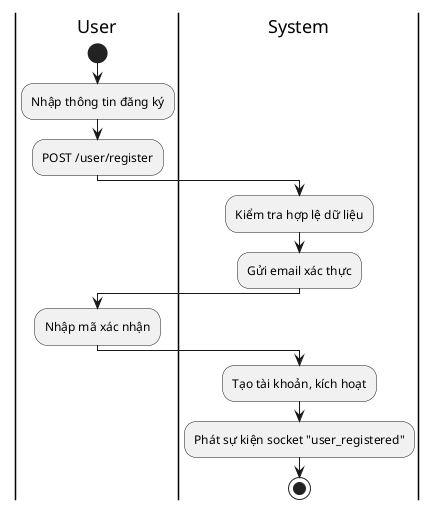

### Đăng nhập

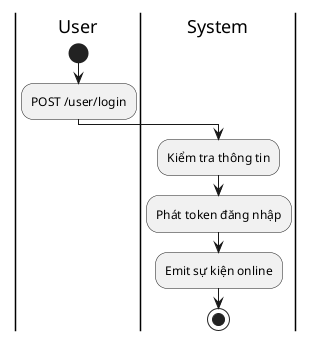

### Cập nhật thông tin

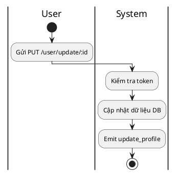

### Gửi tin nhắn

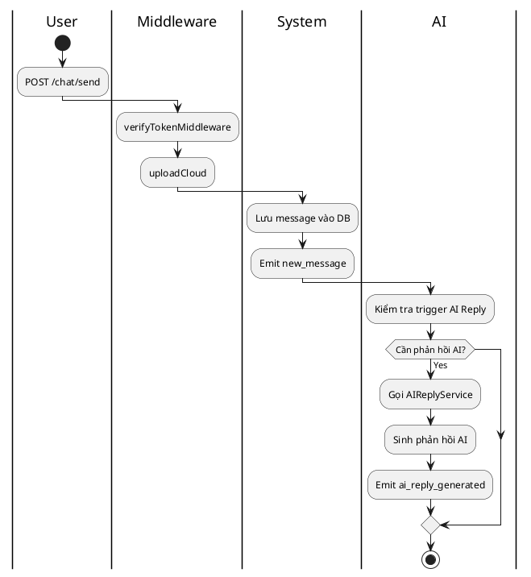

### Xóa tin nhắn

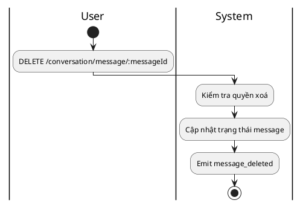

### Tạo nhóm chat

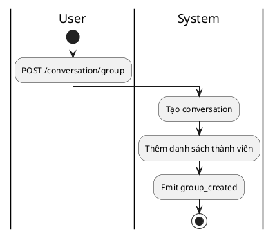

---

## II. ADMIN MODULE

### Dashboard Summary

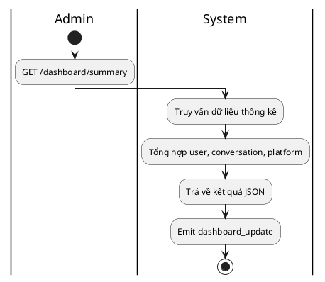

### Platform Status

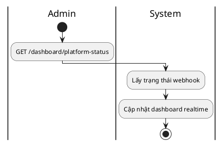

---

## III. AI REPLY MODULE

### Phản hồi tự động tin nhắn

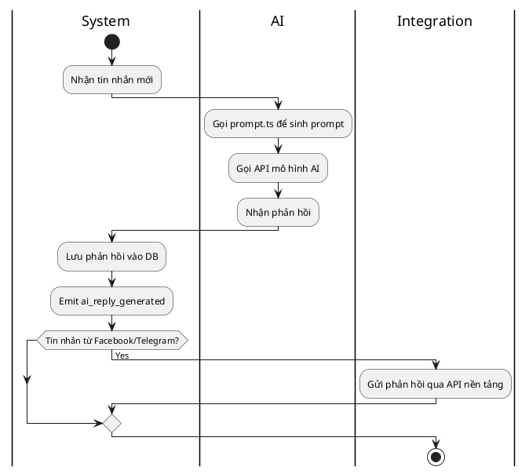

### Học từ phản hồi người dùng

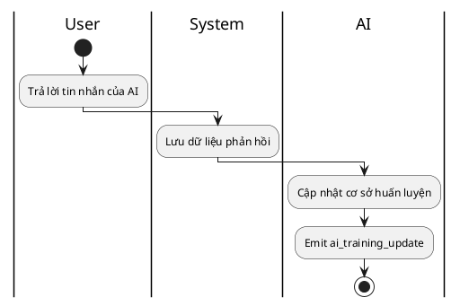

---

## IV. FACEBOOK MODULE

### Kết nối Webhook

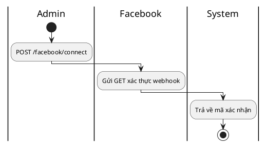

### Nhận tin nhắn Facebook


### Gửi phản hồi đến người dùng Messenger

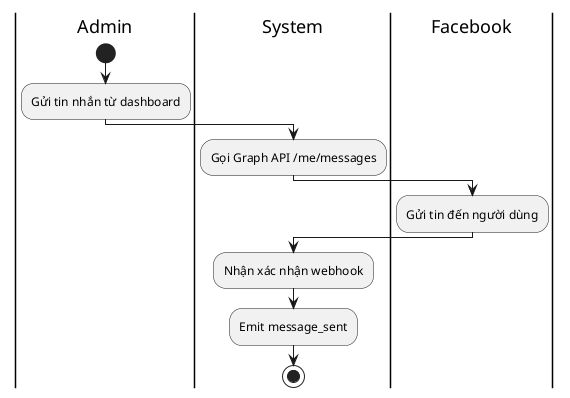

---

## V. TELEGRAM MODULE

### Kết nối Webhook

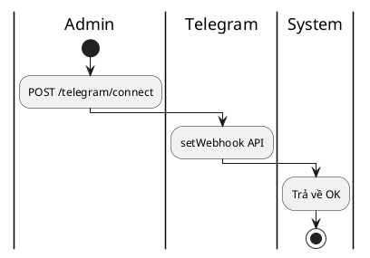

### Nhận tin nhắn Telegram

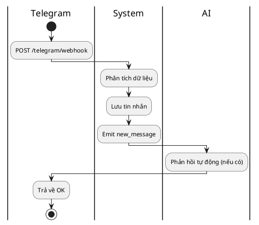

### Gửi tin nhắn ngược lại Telegram

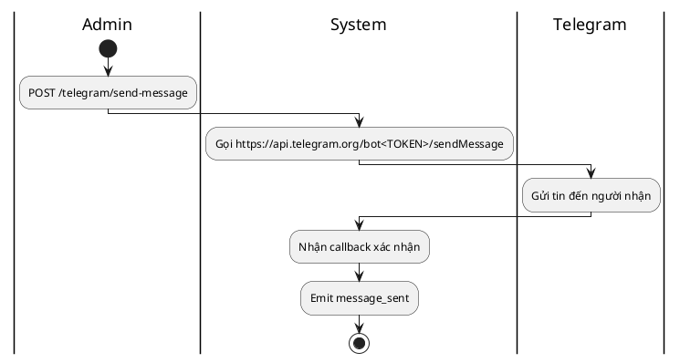

---

## VI. PLATFORM MANAGEMENT

### Connect Platform

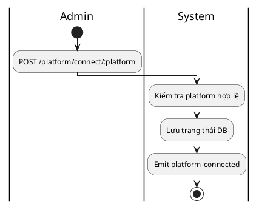

### Disconnect Platform

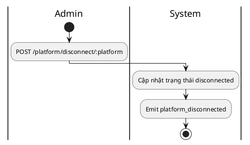

---

## VII. REALTIME MODULE

### Socket Connect

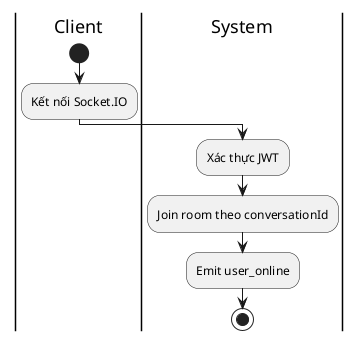

### Truyền tin nhắn realtime

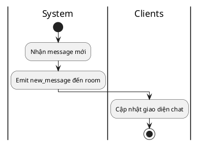

### Online/Offline Tracking

```plantuml
@startuml
|User|
start
:Kết nối socket;
|System|
:Emit user_online;
:Ngắt kết nối;
:Emit user_offline;
|Dashboard|
:Cập nhật danh sách user online;
stop
@enduml
```

---

## VIII. HEALTH SYSTEM

```plantuml
@startuml
|Monitor|
start
:GET /health;
|System|
:Kiểm tra database, socket, API;
:Trả về {ok: true};
|Dashboard|
:Hiển thị trạng thái hệ thống;
stop
@enduml
```
